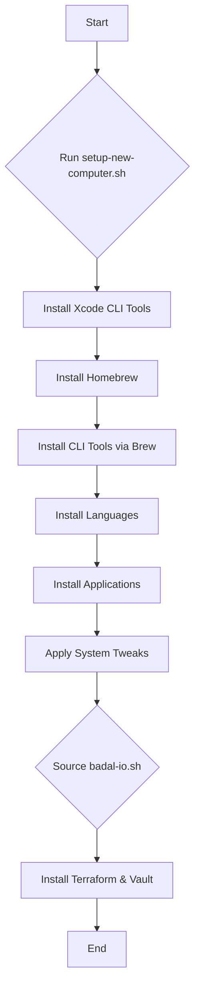

# Script Architecture Overview

This diagram illustrates the main stages of the `setup-new-computer.sh` script execution.

```mermaid
graph TD
    A[Start] --> B{Run setup-new-computer.sh};
    B --> C[Install Xcode CLI Tools];
    C --> D[Install Homebrew];
    D --> E[Install CLI Tools via Brew];
    E --> F[Install Languages];
    F --> G[Install Applications];
    G --> H[Apply System Tweaks];
    H --> I{Source badal-io.sh};
    I --> J[Install Terraform & Vault];
    J --> K[End];
```
